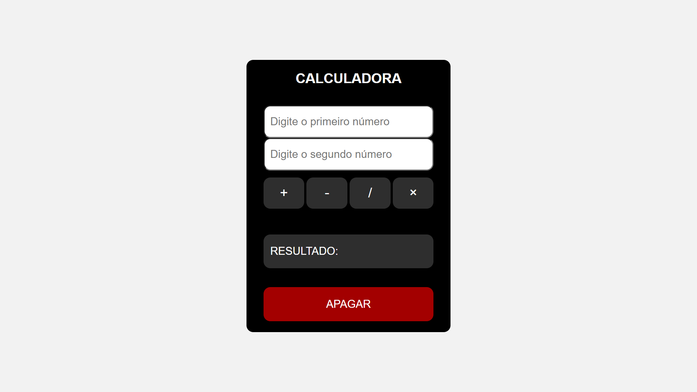
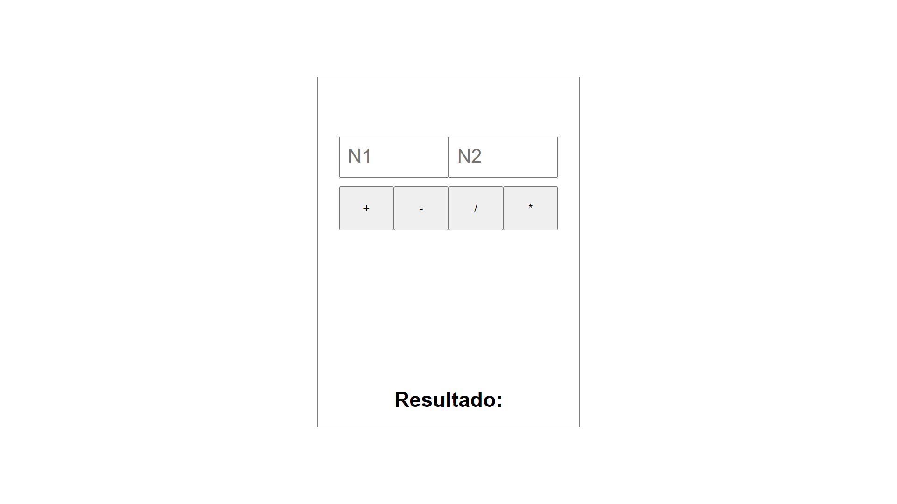

## Calculator Exercise 💻

Atividade proposta durante as aulas de Eventos da DOM da <a target="_blank" href="https://cubos.academy/">**Cubos Academy**</a>. O resultado do projeto e sua estilização foram alterados.

### Funcionalidades acrescentadas:

- [x] Botão de apagar
- [x] Operações com zero
- [x] Aviso para quando algum número for dividido por zero

### Ferramentas utilizadas:
`HTML` `CSS` `JavaScript`

 <a target="_blank" href="https://mi-santana.github.io/calculator-exercise/">**Visualize o projeto**</a>

## Visual [Depois]

## Visual [Antes]

