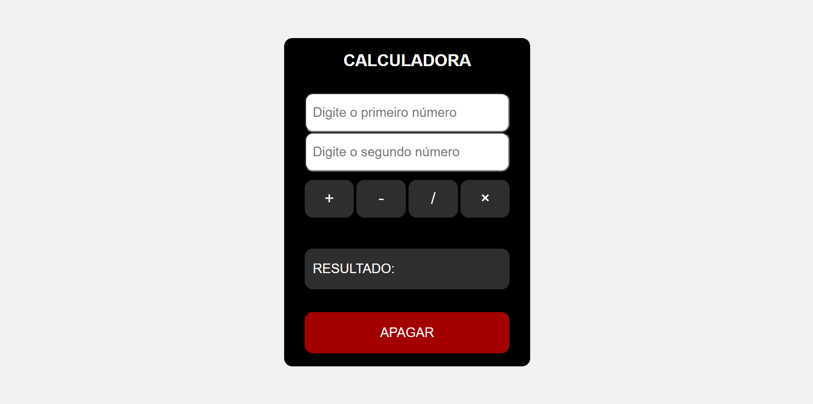

## Calculator - Cubos Academy Exercise 💻

Atividade proposta durante as aulas de Eventos da DOM da Cubos Academy. O resultado do projeto e sua estilização foram alterados. Acrescentei o botão de apagar, operações com zero e um aviso para quando algum número for dividido por zero, por exemplo.

👉🏼 <a href="https://mi-santana.github.io/calculator-exercise/">Acesse o link do projeto</a>

## Visual ✒️

